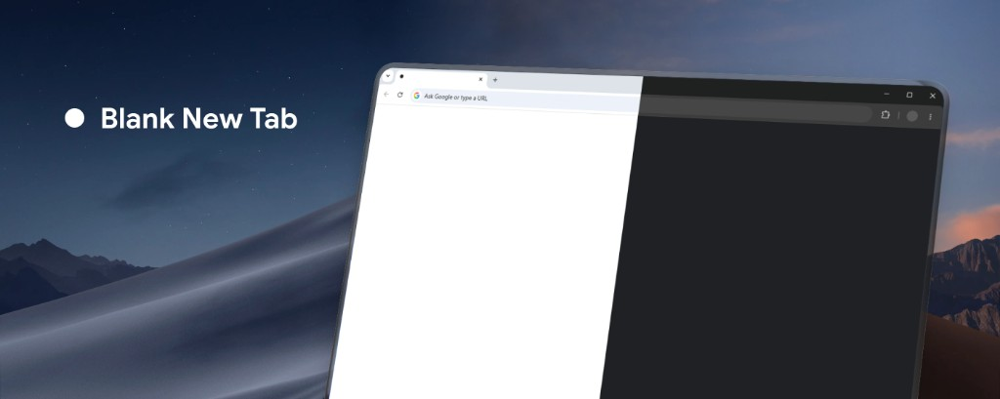

# Blank New Tab



A lightweight browser extension that provides a completely blank new tab page with no title and no icon.

## Install

- [Chrome](https://chromewebstore.google.com/detail/blank-new-tab-page/ijcaekmigmbollknbdefjekkodgibhfn)
- [Firefox](https://addons.mozilla.org/en-US/firefox/addon/cteerakit-blank-new-tab/)
- [Edge](https://microsoftedge.microsoft.com/addons/detail/blank-new-tab-page/ddefejpoppiekbidglmgahkdjekgjepn)

## Support

Use the support tab on the [Chrome Web Store](https://chromewebstore.google.com/detail/blank-new-tab-page/ijcaekmigmbollknbdefjekkodgibhfn), [Firefox Add-ons](https://addons.mozilla.org/en-US/firefox/addon/cteerakit-blank-new-tab/), or [Edge Add-ons](https://microsoftedge.microsoft.com/addons/detail/blank-new-tab-page/ddefejpoppiekbidglmgahkdjekgjepn) listing. Each store already has built-in support.

## Development

1. Install dependencies:
   ```bash
   pnpm install
   ```
2. Start development server:
   ```bash
   pnpm dev
   ```
3. Load the unpacked extension from `.output/chrome-mv3` in `chrome://extensions`.
4. Build for production:
    ```bash
    pnpm build
    ```

## Firefox

1. Develop:
    ```bash
    pnpm dev:firefox
    ```
2. Load the unpacked extension from `.output/firefox-mv3` in `about:debugging#/runtime/this-firefox`.
3. Package for [addons.mozilla.org](https://addons.mozilla.org/developers/):
    ```bash
    pnpm zip:firefox
    ```
   This writes an extension ZIP and a sources ZIP under `.output/`. Upload the extension ZIP to AMO. If AMO asks for source, upload the sources ZIP and use these rebuild steps: `pnpm install` then `pnpm zip:firefox`.
